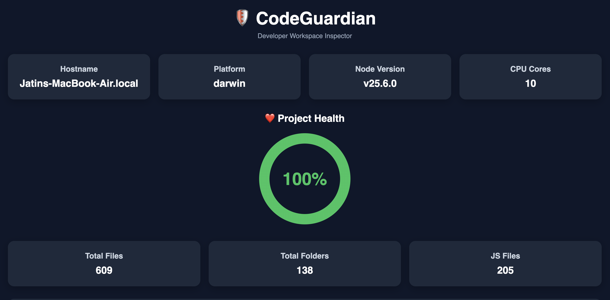
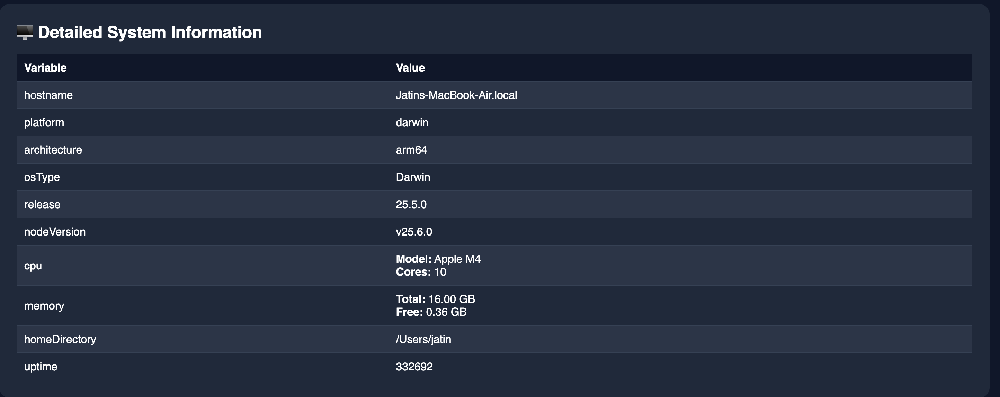
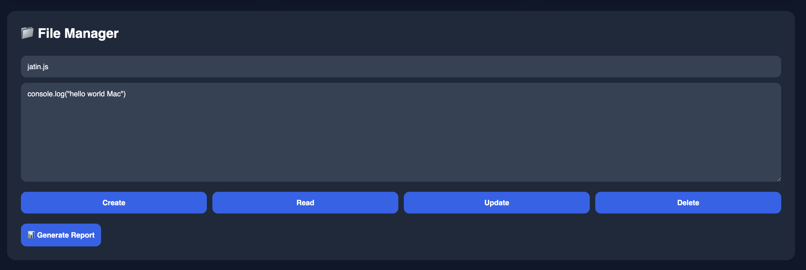
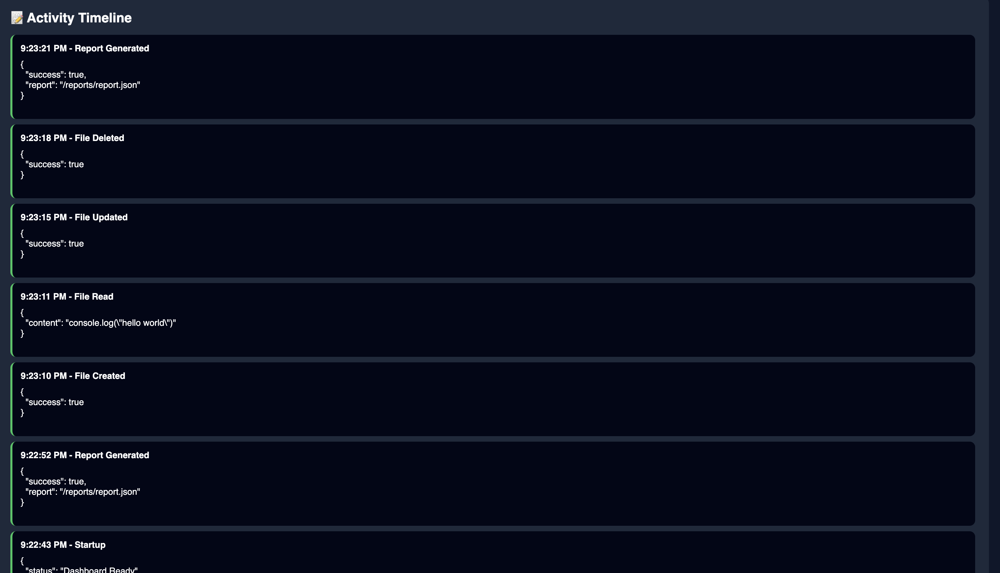

# 🛡️ CodeGuardian

Developer Workspace Inspector built using Node.js, Express.js and JavaScript.

---

## Dashboard Overview

The main dashboard provides real-time system monitoring, project health visualization, workspace statistics, and quick access to file management operations.



---

## 📊 System Monitoring

CodeGuardian collects and displays:

- Hostname
- Platform
- CPU Information
- Node.js Version
- Memory Information
- Architecture
- Uptime

The dashboard automatically refreshes and updates system statistics.



---

## ❤️ Project Health Analysis

The Project Health Gauge evaluates the workspace structure and displays a visual score based on:

- Folder count
- JavaScript files
- Workspace organization

This helps developers quickly understand project quality.


---

## 📁 File Manager

The File Manager allows users to perform CRUD operations directly from the browser.

Supported Operations:

- Create File
- Read File
- Update File
- Delete File

All operations are performed using REST APIs.



---

## 🌍 Environment Analysis

The Environment Analyzer displays detailed operating system information including:

- OS Type
- CPU Model
- CPU Cores
- Total Memory
- Free Memory
- Home Directory


---

## 📝 Activity Timeline

Every action performed inside the application is recorded.

Examples:

- File Created
- File Read
- File Updated
- File Deleted
- Report Generated

This provides complete visibility into user actions.



---
# 📄 Report Generation

CodeGuardian can generate JSON reports containing:

- System Information
- Workspace Statistics
- Project Metadata

Reports are automatically stored inside:

```text
reports/report.json
```

---

# 🏗️ Project Structure

```text
CodeGuardian
│
├── public
│   ├── index.html
│   ├── style.css
│   └── script.js
│
├── src
│   ├── server.js
│   │
│   ├── system
│   │   └── systemInfo.js
│   │
│   ├── files
│   │   ├── fileManager.js
│   │   └── scanner.js
│   │
│   └── analyzer
│       └── envAnalyzer.js
│
├── reports
│   └── report.json
│
├── screenshots
│   ├── dashboard-overview.png
│   ├── file-manager.png
│   ├── system-information.png
│   └── activity-timeline.png
│
├── package.json
└── README.md
```

---

# 🚀 Installation

Clone Repository

```bash
git clone https://github.com/jatin-kumar-soni/CodeGuardian.git
```

Move into Project

```bash
cd CodeGuardian
```

Install Dependencies

```bash
npm install
```

Start Server

```bash
node src/server.js
```

Open Browser

```text
http://localhost:3000
```
